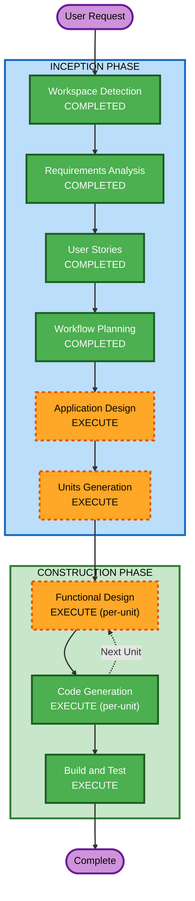

# Execution Plan — Watcher Platform

## Detailed Analysis Summary

### Change Impact Assessment
- **User-facing changes**: Yes — entirely new platform with login, incident forms, dashboards, verification queue
- **Structural changes**: Yes — new microservices architecture from scratch
- **Data model changes**: Yes — new PostgreSQL schemas for tenants, incidents, verification
- **API changes**: Yes — new REST APIs for all services
- **NFR impact**: Minimal for MVP — local Docker deployment, no production scaling concerns

### Risk Assessment
- **Risk Level**: Medium (new project, well-defined scope, but multiple services to coordinate)
- **Rollback Complexity**: Easy (greenfield, no existing system to break)
- **Testing Complexity**: Moderate (multi-tenant isolation, cross-service workflow)

---

## Workflow Visualization



### Text Alternative
```
Phase 1: INCEPTION
  - Workspace Detection (COMPLETED)
  - Requirements Analysis (COMPLETED)
  - User Stories (COMPLETED)
  - Workflow Planning (COMPLETED)
  - Application Design (EXECUTE)
  - Units Generation (EXECUTE)

Phase 2: CONSTRUCTION (per-unit loop)
  - Functional Design (EXECUTE, per-unit)
  - Code Generation (EXECUTE, per-unit)
  - Build and Test (EXECUTE)

Phase 3: OPERATIONS
  - Operations (PLACEHOLDER - skipped)
```

---

## Phases to Execute

### INCEPTION PHASE
- [x] Workspace Detection (COMPLETED)
- [x] Requirements Analysis (COMPLETED)
- [x] User Stories (COMPLETED)
- [x] Workflow Planning (COMPLETED)
- [ ] Application Design — **EXECUTE**
  - **Rationale**: New microservices architecture requires component identification, service boundaries, API contracts, and inter-service communication design. Three backend services + frontend need clear interface definitions.
- [ ] Units Generation — **EXECUTE**
  - **Rationale**: Multiple services (Auth, Incident, Verification, Frontend) need decomposition into ordered units of work with dependency mapping for structured implementation.

### CONSTRUCTION PHASE
- [ ] Functional Design — **EXECUTE** (per-unit)
  - **Rationale**: Each service has business logic (JWT generation, incident lifecycle states, verification pipeline) and data models (users, tenants, incidents, evidence, verification records) that need detailed design before code generation.
- [ ] NFR Requirements — **SKIP**
  - **Rationale**: MVP is local Docker deployment only. No production performance, scaling, or advanced security requirements. Tech stack already decided in requirements.
- [ ] NFR Design — **SKIP**
  - **Rationale**: NFR Requirements skipped, so NFR Design is not applicable.
- [ ] Infrastructure Design — **SKIP**
  - **Rationale**: Infrastructure is a simple Docker Compose setup (PostgreSQL + MinIO + services). No cloud infrastructure, no IaC needed for MVP.
- [ ] Code Generation — **EXECUTE** (per-unit, always)
  - **Rationale**: Implementation planning and code generation for all services.
- [ ] Build and Test — **EXECUTE** (always)
  - **Rationale**: Docker Compose setup, build instructions, and test execution guidance.

### OPERATIONS PHASE
- [ ] Operations — **PLACEHOLDER** (skipped)
  - **Rationale**: Future expansion, not applicable for MVP.

---

## Summary

| Metric | Value |
|--------|-------|
| **Total Stages to Execute** | 7 (Application Design + Units Generation + per-unit Functional Design + per-unit Code Generation + Build and Test) |
| **Stages Skipped** | 3 (NFR Requirements, NFR Design, Infrastructure Design) |
| **Estimated Units** | 4 (Auth Service, Incident Service, Verification Service, Frontend) |
| **Build Priority** | Phase 1: Auth → Phase 2: Incident → Phase 3: Verification → Phase 4: Frontend |

## Success Criteria
- **Primary Goal**: Working end-to-end MVP demonstrating multi-tenant incident logging and verification
- **Key Deliverables**: 3 backend microservices, 1 React frontend, Docker Compose orchestration, seed data, OpenAPI docs
- **Quality Gates**: MVP success criteria from requirements (tenant isolation, incident submission, verification workflow)
